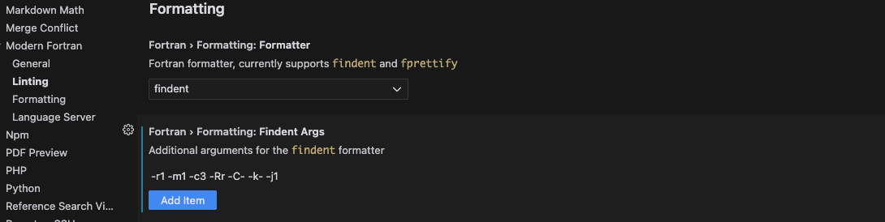

Coding Phantom in VSCode or Cursor AI
=====================================

In VSCode or Cursor there are several helpful settings when editing Phantom source files. After installing a modern Fortran extension, to enforce the indentation conventions in Phantom you should use `findent <https://github.com/wvermin/findent>`_ as in the indentation engine:

.. image:: ../images/vscode-findent.png
  :width: 800
  :alt: findent option in VSCode

and pass it the same options as used in `the bots script <https://github.com/danieljprice/phantom/blob/master/scripts/bots.sh#L288>`_:

