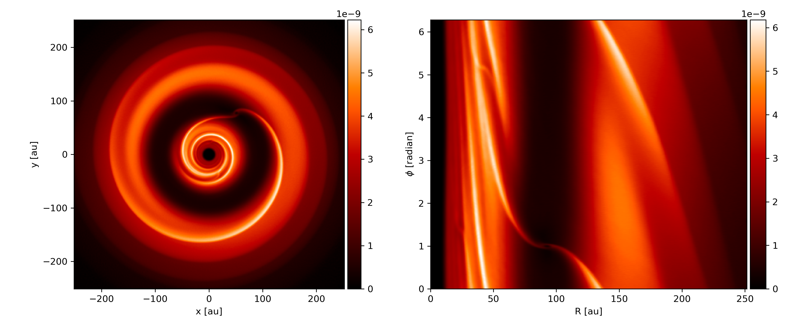
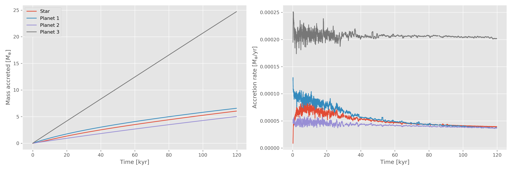

Plonk
=====

Plonk is a Python package for analysis and visualisation of smoothed particle
hydrodynamics data. Plonk is open source.

- Docs: https://plonk.readthedocs.io/
- Repo: https://www.github.com/dmentipl/plonk

Examples
--------

Density projection render of a snapshot in Cartesian coordinates, and polar
coordinates. The data comes from a single Phantom dump.

Mass accretion and accretion rate onto sink particles. The data comes from the
Phantom sink `.ev` files.
