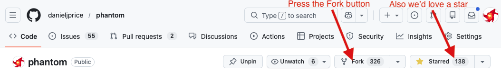
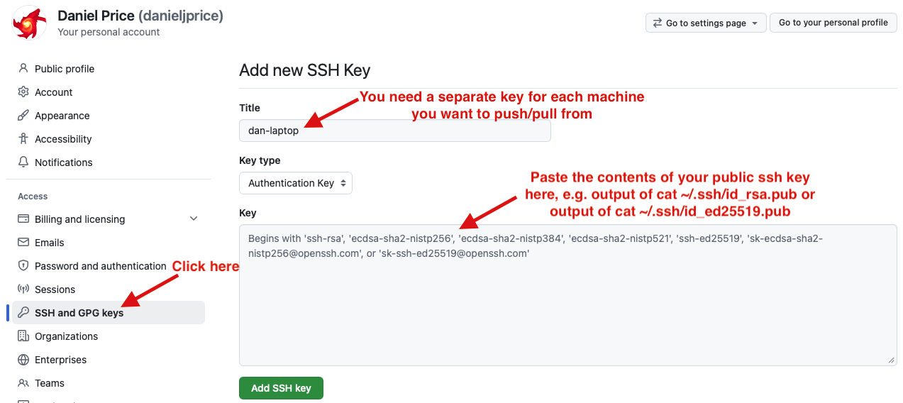

Working with Phantom and git
============================

Make sure you have the git version control system installed.

Getting your first copy (if you just want to use the code)
----------------------------------------------------------

If you just want to use the code, you can get the latest stable version using::

   git clone https://github.com/danieljprice/phantom.git

Getting your first copy (if you plan to edit anything in the source code)
--------------------------------------------------------------------------

Once you have a GitHub account, you must create your own :doc:`fork </developer-guide/fork>`.
This is done using the “fork” button (the big button on top right of the
repo page):

To read/write via ssh you will also need to add your public ssh key to github::

   cd ~/.ssh
   cat id_rsa.pub
   ... some long key is printed ...

If you don't have an ssh key, you can generate one using::

   ssh-keygen
   ... follow the prompts, you can just press enter to accept the defaults ...
   cat ~/.ssh/id_ed25519.pub

Copy everything that was printed above and paste it into the relevant box under
User Icon->Settings->SSH and GPG keys->New SSH key, with a name like "my-laptop" or whatever the
machine you are currently working on is called:

   
You will need to do this once from every machine you want to push changes from.

You can then clone your fork to your computer::

   git clone git@github.com:USERNAME/phantom.git

This gets a copy of the entire phantom repository. Obviously replace
USERNAME with your GitHub username.

Setting your username and email address
---------------------------------------

Before you can push changes, you must ensure that your name and email
address are set, as follows::

   cd phantom
   git config --global user.name "Joe Bloggs"
   git config --global user.email "joe.bloggs@monash.edu"

Please use your full name in the format above, as this is what appears
in the commit logs (and in the AUTHORS file)

Receiving updates from your fork
--------------------------------

Procedure is: stash your changes, pull the updates, reapply your changes::

   git stash
   git pull
   git stash pop

Receiving updates from the master branch
----------------------------------------

To receive updates from the main repo, you can add a branch linking
your fork to the main repo (here denoted "upstream")::

   git remote add upstream https://github.com/danieljprice/phantom.git

This only needs to be done once.

To update, the procedure is: stash your changes, pull the updates,
reapply your changes::

   git stash
   git fetch upstream
   git merge upstream/master
   git stash pop

This will update your fork on your local machine only.

Committing changes to your fork
-------------------------------

Submit changes to Phantom carefully! The first thing is to pull any
upstream changes as described above. Once you have done this, first
check what you will commit::

   git diff

then go through each subset of changes you have made and commit the
file(s) with a message::

   git commit -m 'changed units in dim file for problem x' src/main/dim_myprob.f90

and so on, for all the files that you want to commit. Then, when you’re
ready to push the changeset back to your fork use::

   git push

Note that you will only be allowed to push changes if you have already
updated your copy to the latest version.

If you have just updated your code from the master repo, simply update
your fork via::

   git commit -m 'merge'
   git push

This will push all the remote changes to your forked version of Phantom.

Contributing to community development of the public code
---------------------------------------------------------

This is done through a “pull request”.  To do this,
you can click the “Contribute” button on the GitHub page to request
that your changes be pulled into the master copy of Phantom. Please do
this frequently. Many small pull requests are much better than one giant
pull request!

Automated tests will be performed on all pull requests to ensure nothing gets broken. 
Once these pass and the code has been reviewed, the code can be merged.
